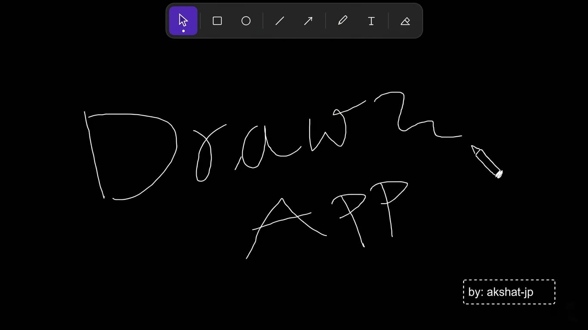

> *Minimal online drawing app for quick sketches, ideas, and creativity.*

<div align="center">
  
</div>

<br />

Sketchli is a clean and lightweight drawing app where you can sketch, draw shapes, write text, and create ideas directly in your browser.

Built for simplicity, speed, and a smooth drawing experience.

---

##  Features

*  Freehand drawing
*  Shapes & lines
*  Pencil & eraser tools
*  Text support
*  Responsive canvas
*  Fast and lightweight

---

##  Tech Stack

* Next.js
* TypeScript
* Tailwind CSS
* HTML5 Canvas

---

##  Getting Started

Clone the repository:

```bash id="omgtd3"
git clone https://github.com/yourusername/sketchli.git
```

Go to the project folder:

```bash id="1htf9r"
cd sketchli
```

Install dependencies:

```bash id="n2mox5"
npm install
```

Run the development server:

```bash id="7c9aok"
npm run dev
```

Open:

```bash id="aew2ca"
http://localhost:3000
```

---

##  How To Use

1. Visit the live site: [sketchli](https://sketchli-draw.vercel.app/) 
2. Select a drawing tool
3. Draw on the canvas
4. Add shapes, text

---

##  Built By

* GitHub: [@akshat-jp](https://github.com/akshat-jp) 
* Twitter/X: [@akshat_jp](https://x.com/akshat_jp) 

---

> ***DO THE HARD WORK SPECIALLY WHEN YOU DON'T FEEL LIKE IT ❤️***
